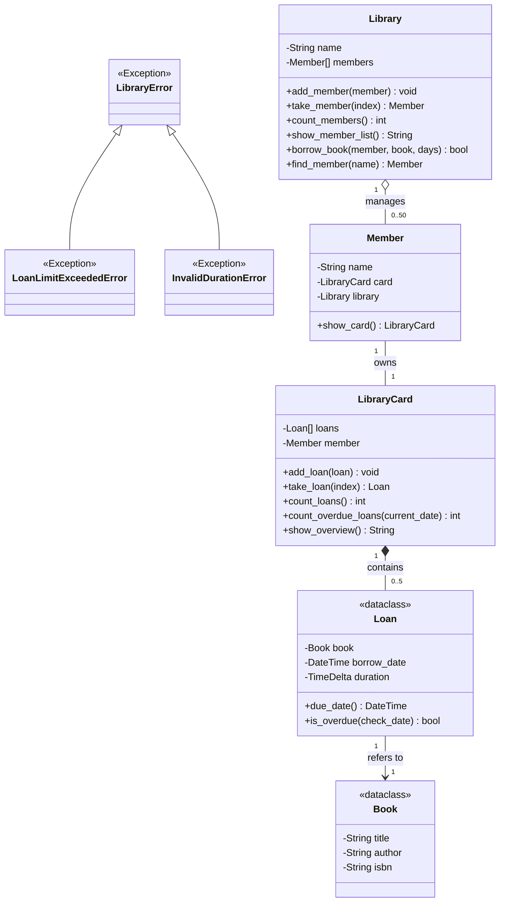

# LB1 - Bibliotheksverwaltung

Sie können in einer komplexen Anwendung selbständig:
- die Klassen erstellen
- die Beziehungen einpflegen (einseitig, zweiseitig, mehrfache)
- den nötigen Ablauf selbst festlegen
- die geforderten Ausgaben erzeugen
- eigene Exceptions definieren, auslösen und fangen
- Dataclasses, DateTime und TimeDelta anwenden

---

## Auftrag
Es ist eine einfache Bibliotheksverwaltung gemäss folgendem Klassendiagramm zu implementieren.
Dabei nutzen Sie Ihr Wissen zu ein- und zweiseitigen Beziehungen sowie der Referenzzuweisung (im vs. ausserhalb des Konstruktors). Ebenso verwenden Sie Mehrfachbeziehungen, Dataclasses, DateTime/TimeDelta und eigene Exceptions.

---

## Klassendiagramm



---

## Allgemeine Hinweise
- Die Methoden `show_…` liefern immer einen String als Returnwert. Der `print`-Befehl wird nur im `main()` genutzt.
- Die Einhaltung der BZZ-Codingstandards (PEP 8, englische Bezeichner, Datenkapselung, Docstrings) wird automatisiert über die Test-Suite (`test_coding_standards.py`) sowie den Pylint-Check geprüft.

---

## Library

### Konstruktor
Die Schreibweise `members[] : Member` im Klassendiagramm zeigt an, dass es sich um eine Liste (Array) handelt.
Initialisieren Sie das Attribut als leere Liste.

### add_member
Fügt ein Mitglied in die Liste ein und pflegt die zweiseitige Beziehung ein.
Beachten Sie, dass gemäss Klassendiagramm max. 50 Mitglieder möglich sind. Das müssen Sie beim Zufügen von Mitgliedern umsetzen.
Beim Versuch mehr als 50 Mitglieder einzufügen, soll die Methode einen `OverflowError` werfen. Bereits vorhandene Mitglieder werden nicht doppelt aufgenommen.

### count_members
Gibt die Anzahl Mitglieder zurück.

### take_member(index)
Liefert das Mitglied beim angegebenen Index.
Bei einem ungültigen Index soll ein `IndexError` ausgelöst werden.

### show_member_list
Diese Methode liefert eine Liste aller Mitglieder. Die Ausgabe könnte wie folgt aussehen:
```text
Anna Meier
Ben Keller
```

### find_member(name)
Sucht ein Mitglied anhand des Namens und liefert das Member-Objekt zurück.
Wird kein Mitglied gefunden, liefert die Methode `None`.

### borrow_book
Erstellt eine Ausleihe für das Buch und verbucht sie auf der Karte des Mitglieds (Standard-Leihdauer: 14 Tage).
Beim Versuch, mehr als 5 Bücher auszuleihen, wirft die Karte einen `LoanLimitExceededError`. Fangen Sie diesen Fehler mit `try/except` ab, geben Sie eine Fehlermeldung auf der Konsole aus und liefern Sie `False` zurück. War die Ausleihe erfolgreich, liefert die Methode `True` zurück.

---

## Member

### Konstruktor
Beachten Sie die Parameter und Defaultwerte gemäss Klassendiagramm.
Verknüpfen Sie das Mitglied und die Bibliothekskarte zweiseitig miteinander.

### show_card
Liefert die LibraryCard des Mitglieds zurück.

---

## LibraryCard

### Konstruktor
Die Schreibweise `loans[] : Loan` im Klassendiagramm zeigt an, dass es sich um eine Liste (Array) handelt.
Initialisieren Sie das Attribut als leere Liste.

### add_loan
Fügt eine Ausleihe in die Liste ein.
Beachten Sie, dass gemäss Klassendiagramm max. 5 Ausleihen möglich sind. Das müssen Sie beim Zufügen umsetzen.
Beim Versuch mehr als 5 Ausleihen einzufügen, soll die Methode einen `LoanLimitExceededError` werfen. Bereits vorhandene Ausleihen werden nicht doppelt aufgenommen.

### take_loan(index)
Liefert die Ausleihe beim angegebenen Index.
Bei einem ungültigen Index soll ein `IndexError` ausgelöst werden.

### count_loans
Gibt die Anzahl Ausleihen zurück.

### count_overdue_loans(current_date)
Zählt alle Ausleihen, die zum angegebenen Prüfdatum bereits überfällig sind.

### show_overview
Diese Methode liefert eine Übersicht über die Karte mit der Anzahl aktiver Ausleihen. Eine mögliche Ausgabe kann wie folgt aussehen:
```text
Card for Anna Meier: 3 loans
```

---

## Loan
Die Klasse `Loan` wird als `@dataclass` realisiert.

### Konstruktor / Initialisierung
Initialisieren Sie die Werte gemäss Klassendiagramm.
Achten Sie auf die Validierung für die Dauer:
Standardmässig beträgt die Dauer 14 Tage. Kann als Ganzzahl (Tage) oder Zeitspanne (`timedelta`) angegeben werden.
Falls die Dauer ungültig ist ($\le 0$ oder $> 60$ Tage), lösen Sie einen `InvalidDurationError` aus. Diese Validierung nehmen Sie im `__post_init__` bzw. Setter vor.

### borrow_date Setter
Je nach Art des Inputs wird das Ausleihdatum unterschiedlich verarbeitet:
- `DateTime` $\Rightarrow$ direkt speichern
- `String` $\Rightarrow$ Umwandeln in DateTime (Format `"%d.%m.%Y"`, z. B. `"15.10.2026"`)
- Alles andere / `None` $\Rightarrow$ Der aktuelle Zeitstempel (`now`) wird gespeichert.

### due_date
Berechnet und liefert das Fälligkeitsdatum (`borrow_date + duration`).

### is_overdue(check_date)
Prüft, ob die Ausleihe zum angegebenen Zeitpunkt (Default: `now`) überfällig ist (`True`/`False`).

---

## Book
Die Klasse `Book` wird als `@dataclass` realisiert.

---

## Exceptions
In `exceptions.py` sind die domänenspezifischen Exceptions definiert:
- `LibraryError` (erbt von `Exception`)
- `LoanLimitExceededError` (erbt von `LibraryError`)
- `InvalidDurationError` (erbt von `LibraryError`)

---

## main
In der main-Methode erzeugen Sie die verschiedenen Objekte und zeigen die Ausgaben an.

### Ausgabe
```text
=== Registered Members ===
Anna Meier
Ben Keller

=== Borrowing Books ===
Ausleihe fehlgeschlagen: Anna Meier hat das Ausleihlimit erreicht.
Anna borrow 6th book result: False (expected False due to limit)

=== Card Overview ===
Card for Anna Meier: 5 loans
Overdue loans for Anna in 25 days: 3
```

---

## Unit tests & Autograding
Testen Sie die Klassen schrittweise mit `pytest`:
```bash
pytest -v
```
Oder mit dem bereitgestellten Test-Skript:
```bash
./test.sh
```

**Bewertungskomponenten:**
- **Unittests:** 36 Tests für funktionale Korrektheit (Klassen, Beziehungen, Exceptions, DateTime, Listen).
- **Codingstandards & Linting:** 4 Tests in `test_coding_standards.py` sowie Pylint-Score 10.0/10 (PEP 8, Datenkapselung, Docstrings).

---

## Abgabe
Mittels Push ins private GitHub-Repository.
