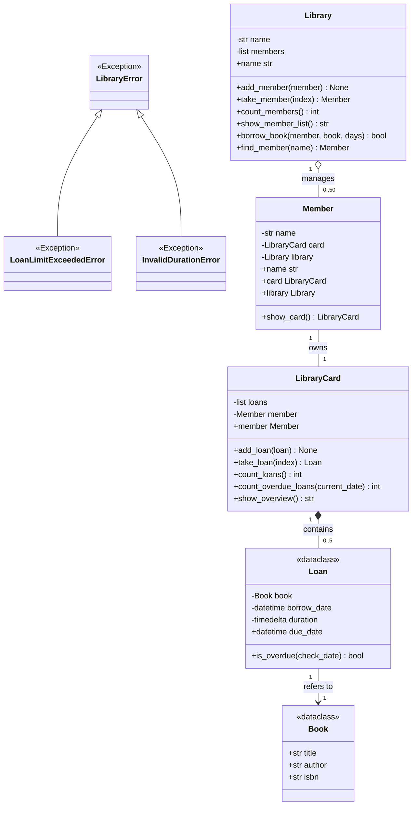

# Leistungsbeurteilung 1 (LB1) – Vorbereitungsprojekt: Bibliotheksverwaltung (Library Management)

## 1. Ausgangslage & Kontext
Im Rahmen der Leistungsbeurteilung 1 im Modul M320 (Objektorientiertes Programmieren mit Python) vertiefen Sie den Umgang mit:
- **Objektbeziehungen** (einseitig/zweiseitig, 1:1, 1:n, im vs. ausserhalb des Konstruktors)
- **Listenverwaltung** (Elemente hinzufügen, auslesen, zählen, Limits überwachen)
- **Dataclasses** (Reine Dataclass & Dataclass mit Properties/Validierung)
- **Datum & Zeit** (`datetime` und `timedelta`)
- **Datenkapselung** (`@property` und `@setter`)
- **Exceptions** (eigene Exceptions definieren, auslösen mit `raise` und fangen mit `try/except`)
- **Codingstandards** (PEP 8 & BZZ-Codingstandards, englische Bezeichner)

In diesem Übungsprojekt implementieren Sie ein **Bibliotheksverwaltungssystem**. Das Projekt ist mit vollständigen Unittests (`pytest`) und Pylint-Checks ausgestattet. Ihre Aufgabe ist es, die vorbereiteten Methoden-Stubs schrittweise zu implementieren, bis alle Tests **grün** sind und die Codingstandards eingehalten werden.

---

## 2. UML-Klassendiagramm



---

## 3. Spezifikation der Module und Klassen

### 3.1 Modul `exceptions.py`
Hier werden domain-spezifische Exceptions definiert:
- `LibraryError`: Basisklasse aller Bibliotheksfehler (erbt von `Exception`).
- `LoanLimitExceededError`: Fehler bei Überschreitung des Ausleihlimits (erbt von `LibraryError`).
- `InvalidDurationError`: Fehler bei unzulässiger Ausleihdauer (erbt von `LibraryError`).

---

### 3.2 Modul `book.py`
Repräsentiert ein Buch.
- Als Dataclass gemäss Klassendiagramm umsetzen.

---

### 3.3 Modul `loan.py`
Repräsentiert eine Ausleihe. Als Dataclass mit Kapselung (Properties/Setter) umsetzen.
- **Initialisierung:**
  - Nimmt Buch, Ausleihdatum und Dauer entgegen.
  - Standardmässig wird als Ausleihdatum das aktuelle Datum (`now`) verwendet. Falls ein Datums-String im Format `"%d.%m.%Y"` (z. B. `"15.10.2026"`) übergeben wird, muss dieser umgewandelt werden.
  - Die Standard-Leihdauer beträgt 14 Tage. Kann als Ganzzahl (Tage) oder Zeitspanne übergeben werden.
  - **Validierung:** Ist die Ausleihdauer $\le 0$ oder $> 60$ Tage, wird ein `InvalidDurationError` ausgelöst.
- **Methoden & Properties:**
  - `due_date`: Berechnet und liefert das Fälligkeitsdatum (Ausleihdatum + Dauer).
  - `is_overdue(check_date)`: Prüft, ob die Ausleihe zum angegebenen Zeitpunkt (Standard: `now`) überfällig ist (`True`/`False`).

---

### 3.4 Modul `library_card.py`
Verwaltet die Ausleihen eines Mitglieds.
- **Konstruktor:**
  - Initialisiert eine leere Sammlung für Ausleihen und speichert die optionale Referenz zum Mitglied.
- **Methoden:**
  - `add_loan(loan)`:
    - Fügt eine neue Ausleihe hinzu.
    - Maximal 5 aktive Ausleihen sind erlaubt. Wird versucht, eine weitere Ausleihe hinzuzufügen, wird ein `LoanLimitExceededError` ausgelöst.
    - Bereits vorhandene Ausleihen werden nicht doppelt aufgenommen.
  - `take_loan(index)`:
    - Liefert die Ausleihe an der gewünschten Position zurück.
    - Löst bei ungültiger Position einen `IndexError` aus.
  - `count_loans()`:
    - Gibt die Anzahl der aktiven Ausleihen zurück.
  - `count_overdue_loans(current_date)`:
    - Zählt alle Ausleihen, die zum Prüfdatum bereits überfällig sind.
  - `show_overview()`:
    - Liefert eine Übersicht als Text (z. B. `"Card for Anna Meier: 3 loans"`).

---

### 3.5 Modul `member.py`
Repräsentiert ein Bibliotheksmitglied.
- **Konstruktor:**
  - Initialisiert das Mitglied und stellt die gemäss Klassendiagramm definierte Beziehung zur Karte her.
- **Methoden:**
  - `show_card()`:
    - Gibt die zugehörige Karte zurück.

---

### 3.6 Modul `library.py`
Repräsentiert die Bibliothek und verwaltet Mitglieder.
- **Konstruktor:**
  - Initialisiert eine leere Bibliothek.
- **Methoden:**
  - `add_member(member)`:
    - Registriert ein neues Mitglied und stellt die Beziehung gemäss Klassendiagramm her.
    - Maximal 50 Mitglieder sind zulässig; darüber hinaus wird ein `OverflowError` ausgelöst.
    - Duplikate werden ignoriert.
  - `take_member(index)`:
    - Liefert das Mitglied an der Position zurück; bei ungültiger Position wird ein `IndexError` ausgelöst.
  - `count_members()`:
    - Gibt die Anzahl registrierter Mitglieder zurück.
  - `show_member_list()`:
    - Liefert einen Text mit den Namen aller Mitglieder, jeweils durch einen Zeilenumbruch getrennt.
  - `find_member(name)`:
    - Sucht nach einem Mitglied anhand des Namens und gibt es zurück (oder `None`, wenn nicht gefunden).
  - `borrow_book(member, book, days)`:
    - Erstellt eine Ausleihe für das Buch mit der angegebenen Tagesanzahl (Standard: 14) und fügt sie der Karte des Mitglieds hinzu.
    - Tritt dabei ein `LoanLimitExceededError` auf, wird dieser abgefangen, eine Fehlermeldung auf der Konsole ausgegeben und `False` zurückgegeben.
    - War die Ausleihe erfolgreich, wird `True` zurückgegeben.

---

## 4. Codingstandards
Die Einhaltung der BZZ-Codingstandards und PEP 8 wird automatisiert über die Test-Suite (`test_coding_standards.py`) sowie den Pylint-Check geprüft.
- Referenz: [BZZ Codingstandards für Python](https://wiki.bzz.ch/howto/codingstandards/start)

---

## 5. Überprüfung & Ausführung

### Unittests ausführen:
Im Projektverzeichnis `m320-lb1-library` ausführen:
```bash
/home/jepedaia/PycharmProjects/M320/m320-ix25-m320-lu09-a01-school-ia25b-grimaj/.venv/bin/pytest -v
```
(Oder bei aktivem venv einfach: `pytest -v`)

### Pylint-Prüfung ausführen:
```bash
python3 _run_pylint.py
```
Oder direkt:
```bash
/home/jepedaia/PycharmProjects/M320/m320-ix25-m320-lu09-a01-school-ia25b-grimaj/.venv/bin/pylint --rcfile .github/autograding/pylintrc exceptions.py book.py loan.py library_card.py member.py library.py
```

### Hauptprogramm ausführen:
```bash
python3 main.py
```

